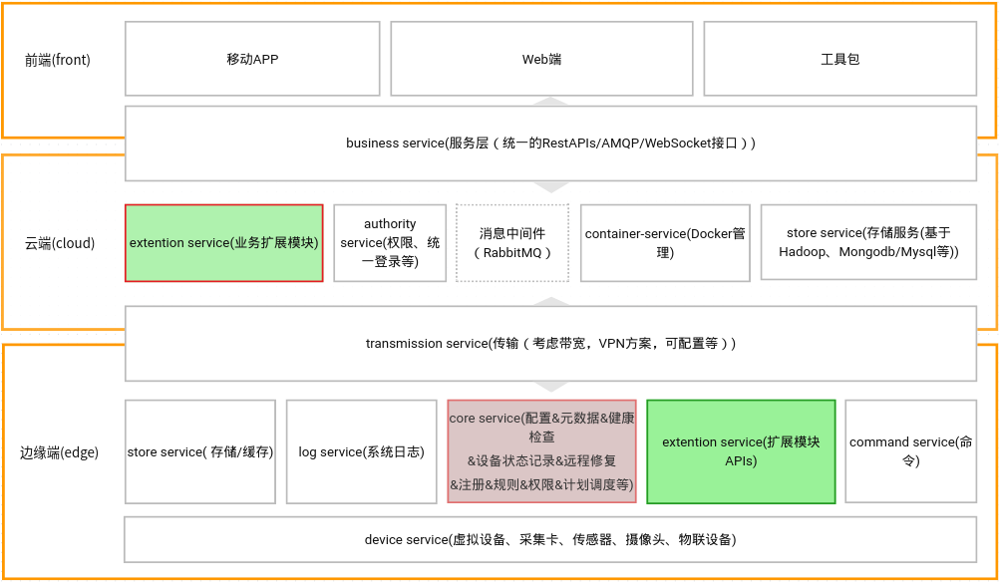
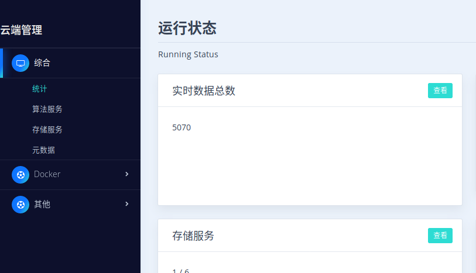

# star-cloud

## 项目介绍
星云-物联业务平台

该项目中旨在构建一个从边缘端到云端数据汇聚的平台，取名星云。

因为考虑到性能问题，初步计划采用Go(edge端，version1.10+)和java(cloud端，version1.8+)语言编写。

[github源码地址](https://github.com/mythad/star-edge-cloud)
QQ交流群：582945208

## 软件架构

希望架构做到以下几点：
1. 不用或者少用框架，后期非常有可能受制于框架
2. 紧凑架构，尽量精简。减少数据复制，提升程序效率
3. 容易扩展，简单扩展

系统架构图



> 注：存在一些已知问题：
> * 尚未对接口进行定义，包括设备端接口，功能扩展的接口
> * 规则引擎和调度服务是否成为单独模块？还是只是在扩展模块里体现？

### 边缘端
边缘端目标是采集数据，集成算法。需要完成以下功能：
> * 多传感器情况下的大数据量(包括数据的复制问题）
> * 可以扩展算法模块和其他模块
> * 智能网关，断路器的容错机制--健康检查
> * 调度功能
> * 消息总线机制--传输层
> * 考虑视频业务情况
> * 日志功能，记录系统、传感器的状态，数据可回溯
> * 应具有数据存储（或缓存）功能，考虑使用一种特别数据库
> * 多协议的支持

采用微服务架构，各模块间采用[rpcx](https://github.com/smallnest/rpcx)通信,主要功能如下：

1. core service--核心服务
> * 负责添加传感器元数据添加，当有新传感器加入时，应该由传输transmission负责将消息通知到包括device的各模块。
> * 负责各种配置信息存储。
> * 负责各模块和设备的状态检查，可以通过心跳机制和各设备发送来的消息判断。
> * 负责系统运行时设备状态的记录，发送到store模块进行记录。
> * 远程控制和管理。version2.0后期添加该功能。
> * 负责调度功能。version2.0后期添加该功能。
> * 规则引擎，比如：报警规则等控制。version2.0后期添加该功能。

2. log service--系统日志服务
> * 基于sqlite记录各模块状态信息。便于出现错误时分析，后期可能在此基础上实现故障自修复功能。

3. store service--存储服务
> * 元数据存储
> * 配置信息存储
> * 缓存服务，基于key-value
> * 各类设备数据存储

4. command service--命令服务
> * 负责将业务端命令传送给设备
> * 负责将运行时调度命令传送给设备（比如规则引擎发来的定时采集数据命令）

5. extention service--模块扩展接口服务
> * 通过扩展接口实现过滤功能、算法功能等

6. device service--设备服务
> * 设备驱动--与实际设备是一对多或一对一的关系
> * 集成多种协议的传感器
> * 集成摄像头，视频数据可以直接传给上端，这里主要是采集视频数据分析或转发的功能，类似于雾计算
> * 集成物联网设备
> * 集成虚拟设备

7. transmission--传输服务
> * 向云端传输数据，使用AMQP/Http协议（也可考虑使用rpcx？）
> * 向内转发命令

### 云端
基于docker的容器云平台，目标是汇集数据，进行计算。需要完成以下功能：
> * 数据存储和分析，可使用具有map/reduce功能的数据库（hbase/mongodb），便于以后大数据分析
> * 具有RestAPI的数据接口
> * 具有历史数据导入功能
> * docker云应具有网络隔离功能

云端最主要的功能是提供数据存储服务和基于docker(CAAS)弹性扩展能力，可运行较复杂的并行算法。
1. extention--业务扩展模块服务
> * 通过扩展接口实现过滤功能、算法功能等

2. container service--docker的管理服务
调用docker-ce的api实现：
> * 需要考虑安全性(包括隔离等)
> * 需要考虑组网模式
> * 需要考虑数据分流（多网卡）

3. store service--存储服务
主要基于hadoop镜像，mysql镜像等。
> * 将数据存入db(hbase,mongodb,mysql等数据库)

4. business service--提供服务
> * 数据查询服务
> * 命令转发服务

5. 消息中间件
> * 可以安装RabbitMQ，暂时无需实现功能

### 监控界面
可视化呈现数据。需要完成以下功能:

1. Web界面
> * 基于角色权限功能
> * 统计设备状态信息（不同维度）
> * 设备信息

2. 工具包
> * 实现一些类似诊断分析，故障修复等功能的工具

3. 移动App
> * 留待2.0开发

## 开发环境

1. 使用visual studio code进行开发
2. java1.8+
3. go1.9+
4. vscode中搜索java和go，安装debugger for java,java Extension pack, maven for java, spring boot extension pack, spring boot tools,markdownlint
5. maven和gradle，并配置国内源：maven { url 'http://maven.aliyun.com/nexus/content/groups/public/' }
6. 云端开发使用vscode打开starcloud_cloud工作区文件
7. 云端开发使用vscode打开starcloud_edge工作区文件

## 部署教程
在Linux--Deepin15.5下,进入deploy目录，执行编译脚本。

### edge端

1. 执行部署命令：
```
cd deploy/
sudo chmod +x edge.sh
./edge.sh
```
2. 运行系统：
```
sudo ./core
```
3. 访问：[http://localhost:21000/html/index.html](http://localhost:21000/html/index.html)

4. 运行log服务
5. 运行store服务
6. 添加设备设备，选择compile目录下编译好的文件
7. 添加扩展设备，选择compile目录下编译好的文件

### cloud端

测试坏境搭建（安装docker,docker-compose略)：

1. 打开2375端口（后面将使用tls访问，开启2376）：
```
vi /lib/systemd/system/docker.service
```
2. 找到Execstart=/usr/bin/dockerd后加上
```
-H tcp://0.0.0.0:2375 -H unix://var/run/docker.sock  
```
保存并且退出

```
systemctl daemon-reload
service docker restart//重启启动docker
systemctl stats docker//可以查看相关内容，看看2375是否已经设置好
```

3. 访问和验证：
[http://localhost:2375/info](http://localhost:2375/info)

4. 拉取hbase容器 
```
docker pull harisekhon/hbase 
```
5. 启动容器 
```
docker run -d -h myhbase -p 2181:2181 -p 8080:8080 -p 8085:8085 -p 9090:9090 -p 9095:9095 -p 16000:16000 -p 16010:16010 -p 16201:16201 -p 16301:16301 -p 16020:16020 -p 16030:16030 --name hbase1.3 harisekhon/hbase
```

6. 访问及验证hbase
[http://localhost:16010/master-status](http://localhost:16010/master-status)

7. 执行命令：
```
cd deploy/
sudo chmod +x cloud.sh
mvn clean package
./cloud.sh
```
8. 运行：
```
java -jar caas*.jar
#这种方法还没有尝试:nohup java -jar ***.jar &
```
9. 部署tomcat
下载：[http://mirrors.shu.edu.cn/apache/tomcat/tomcat-8/v8.5.37/bin/apache-tomcat-8.5.37.tar.gz](http://mirrors.shu.edu.cn/apache/tomcat/tomcat-8/v8.5.37/bin/apache-tomcat-8.5.37.tar.gz)
10. 进入目录后运行：
```
./startup.sh
```
11. 拷贝display下web项目到webapps之中
```
cp -r */web */webapps/
```
12. 访问及验证：
[http://localhost:8080/web/index.html]http://localhost:8080/web/index.html

> 注意：
> 1.目前仅仅是演示版本，尚有很多很多功能没有完成，部分功能还有Bug，但这只是开始   
> 2.查看sqlite数据，可以使用SQLiteStudio

## 参与贡献

1. Fork 本项目
2. 新建 Feat_xxx 分支
3. 提交代码
4. 新建 Pull Request

## 参考设计
https://nexus.edgexfoundry.org/content/sites/docs/staging/master/docs/_build/html/

## 待完成功能
edge端 
1. 浏览器兼容性
2. 调度模块
3. 规则引擎
4. 各种协议接入
5. 添加node节点？

cloud端
1. 多个node节点管理，hbase镜像制作
2. 管理网络(vswitch?)
3. 数据统计

